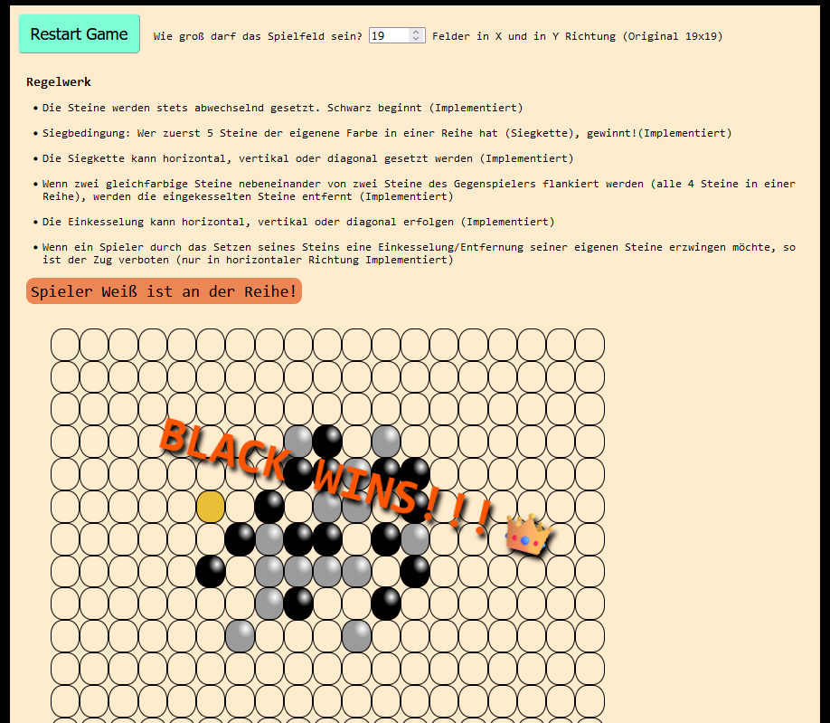

I love Go Bang! And that's why it's a pleasure for me to rebuild the game to sharpen my web developer skills. My goals are:

- appealing visualization of the playing field

- to reproduce the complete set of rules

- options for certain settings

- save and load game states

- initially only playable from one client

- the game should be deployed

- full responsive design

- accessibility as good as possible

the time horizon until completion is indefinite.

### development status of the app (28.03.24)

